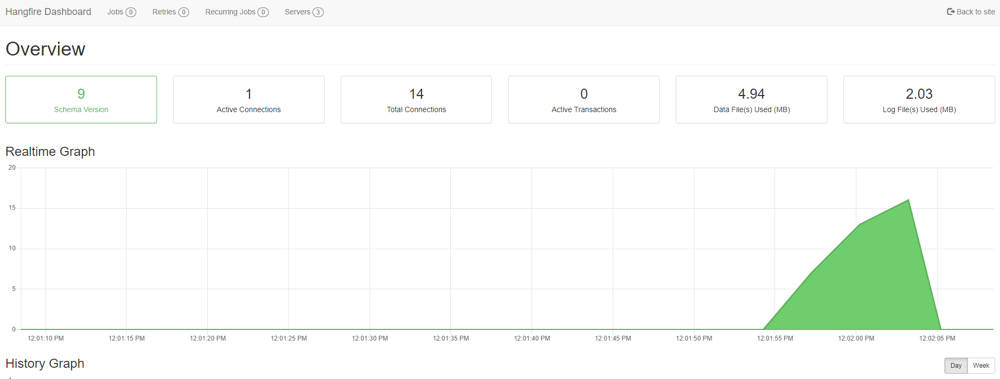

# About

A small [Hangfire](https://www.hangfire.io/) Proof of Concept.

Please note that architecture and clean code have mostly not been applied, this focuses on demonstrating Hangfire only. Please never use this architecture for intended production environments. For production environments I'd highly advise to create a separate database for Hangfire.



# Requirements

- [SDK](https://dotnet.microsoft.com/en-us/download/dotnet/7.0)
- [Hangfire NuGet](https://www.nuget.org/packages/Hangfire)
- MSSQL. To create the database, execute the **Update-Database** command.
  - Modify the **ConnectionString** constant in **Program.cs** as needed.


# Test URLS

## https launch profile

- https://localhost:7143/hangfire
- https://localhost:7143/swagger/index.html

# Migration instructions

## Add-Migration

```bash
Add-Migration Initial -OutputDir "Dal/Migrations" -verbose
```

## Update-Database

```bash
Update-Database -verbose
```

## Remove migration

```bash
Remove-Migration -verbose
```

# From the Hangfire readme:

By default, ONLY LOCAL requests are allowed to access the Dashboard. Please
see the `Configuring Dashboard authorization` section in Hangfire documentation:
https://docs.hangfire.io/en/latest/configuration/using-dashboard.html#configuring-authorization

## Sample ASP.NET Core Startup class

```c#
using Microsoft.AspNetCore.Builder;
using Microsoft.Extensions.DependencyInjection;
using Hangfire;

namespace MyWebApplication
{
    public class Startup
    {
        public void ConfigureServices(IServiceCollection services)
        {
            services.AddHangfire(x => x.UseSqlServerStorage("<connection string>"));
            services.AddHangfireServer();
        }
        
        public void Configure(IApplicationBuilder app)
        {
            app.UseHangfireDashboard();
        }
    }
}
```

## Sample [OWIN](https://learn.microsoft.com/en-us/aspnet/core/fundamentals/owin?view=aspnetcore-7.0) Startup class

```c#
using Hangfire;
using Microsoft.Owin;
using Owin;

[assembly: OwinStartup(typeof(MyWebApplication.Startup))]

namespace MyWebApplication
{
    public class Startup
    {
        public void Configuration(IAppBuilder app)
        {
            GlobalConfiguration.Configuration
                .UseSqlServerStorage("<name or connection string>");

            app.UseHangfireDashboard();
            app.UseHangfireServer();
        }
    }
}

```

# Hangfire jobs

## Normal

```c#
string jobId = BackgroundJob.Enqueue(() => MyMethod(optionalParams));
```

## Delayed

```c#
string jobId = BackgroundJob.Schedule(() => MyMethod(optionalParams), TimeSpan.FromMilliseconds(registerUserDelayedRequestModel.DelayInMs));
```

## Recurring

```c#
RecurringJob.AddOrUpdate(() => MyMethod(optionalParams), Cron.Minutely);
```

## Continuous

Used for job chaining. E.x. User registers and after user was created in persistent storage, you want to send an e-mail.

```c#
string jobId = BackgroundJob.Enqueue(() => MyMethod(optionalParams));
string jobId2 = BackgroundJob.ContinueJobWith(jobId, () => MyFollowUpMethod(optionalParams));
```

